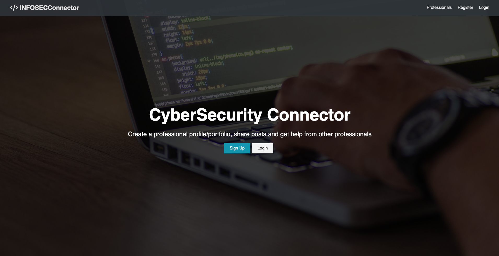
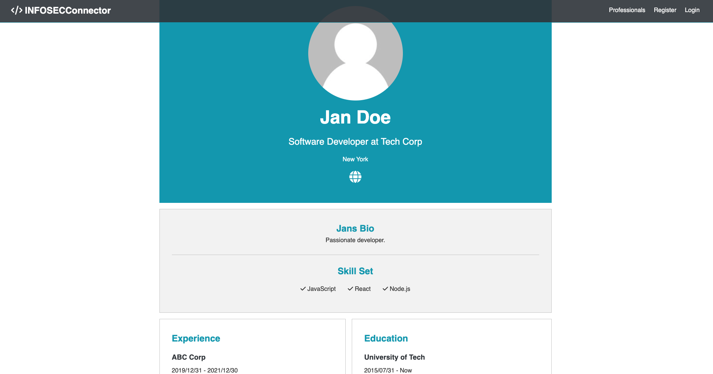
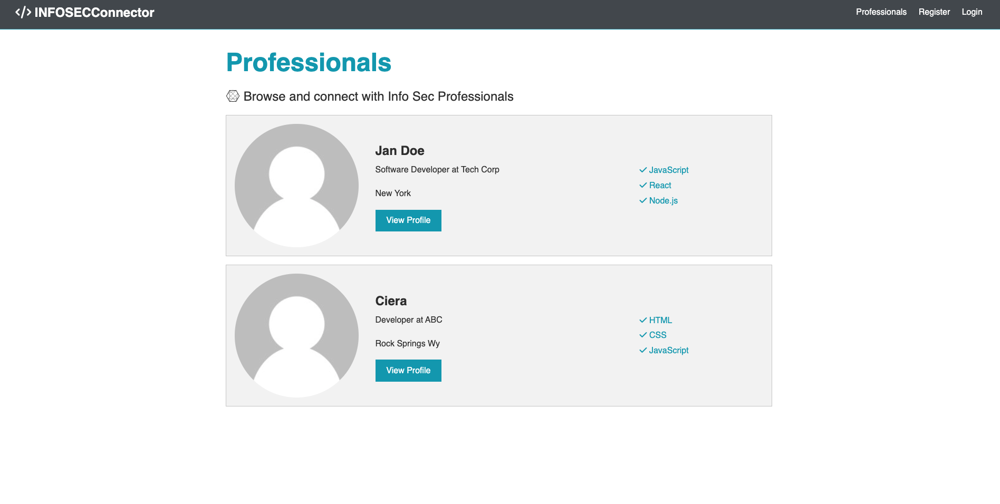
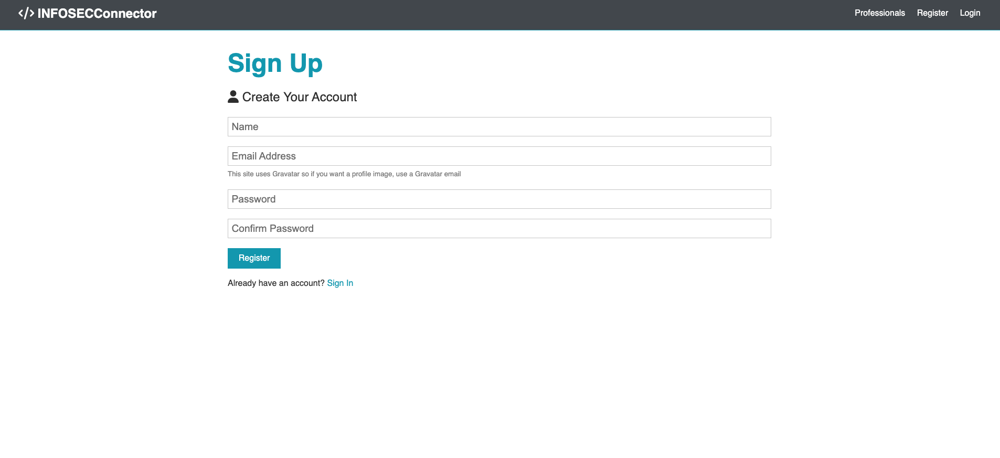

# SecConnector

SecConnector is a social networking platform designed specifically for cybersecurity professionals. It provides a space for experts to connect, share knowledge, and discuss industry trends.

## Table of Contents
- [Features](#features)
- [Installation](#installation)
- [Usage](#usage)
- [Tech Stack](#tech-stack)
- [Scripts](#scripts)
- [License](#license)
- [Contributing](#contributing)
- [Bugs and Issues](#bugs-and-issues)
- [Author](#author)

## Features
- User authentication and authorization (JWT-based login/signup)
- Profile creation and management
- Post creation and commenting
- Secure API with Express and MongoDB
- State management with Redux
- Real-time updates using React and Redux

## Installation

### Prerequisites
Ensure you have the following installed:
- Node.js (latest LTS version recommended)
- MongoDB (local or cloud-based like MongoDB Atlas)
- npm or yarn

### Setup
1. Clone the repository:
   ```sh
   git clone https://github.com/ciavilla/CyberSecConnector.git
   cd CyberSecConnector
   ```
2. Install server dependencies:
   ```sh
   npm install
   ```
3. Install client dependencies:
   ```sh
   cd client
   npm install
   ```
4. Create a `.env` file in the root directory and add:
   ```sh
   MONGO_URI=your_mongo_db_connection_string
   JWT_SECRET=your_jwt_secret
   ```
5. Start the application:
   ```sh
   npm run dev
   ```
   This will concurrently run both the client and server.

## Usage
- Open `http://localhost:3000` to access the frontend.
- The backend runs on `http://localhost:5000`.
- Register or log in to create and interact with posts.

## Tech Stack
### Backend
- Node.js
- Express
- MongoDB & Mongoose
- JSON Web Tokens (JWT)
- bcrypt.js (password hashing)

### Frontend
- React
- Redux for state management
- React Router for navigation
- Axios for API calls

## Scripts
- `npm start` - Runs the server
- `npm run server` - Starts the backend with nodemon
- `npm run client` - Starts the React frontend
- `npm run dev` - Runs both backend and frontend concurrently
- `npm run build` - Builds the React frontend for production

## Screenshots

### Home Page


### User Profile Page


### Users Profile Page


### Sign Up Page


## License
This project is **UNLICENSED**.

## Contributing
Contributions are welcome! Feel free to open a pull request.

## Bugs and Issues
If you encounter any bugs, please report them in the [GitHub Issues](https://github.com/ciavilla/CyberSecConnector/issues).

## Author
**Ciera Villalpando**
- GitHub: [ciavilla](https://github.com/ciavilla)

